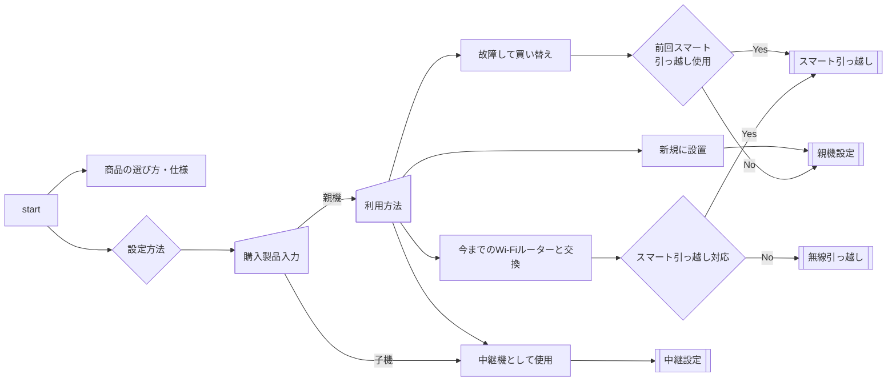

# Wi-Fi ルーター サポートフロー

Wi-Fiルーターの設定や問題解決をサポートするWebアプリケーションです。

## フローチャート



## 技術仕様

- **フレームワーク**: SvelteKit (TypeScript)
- **CSSフレームワーク**: Bootstrap 5
- **アイコン**: Bootstrap Icons
- **デプロイ**: 静的サイト（@sveltejs/adapter-static）

## 開発環境のセットアップ

### 依存関係のインストール

```sh
npm install
```

### 開発サーバーの起動

```sh
npm run dev
```

開発サーバーは http://localhost:5173/ で起動します。

## ビルド・デプロイ

### 静的サイトのビルド

```sh
npm run build
```

ビルドされたファイルは `build` ディレクトリに生成されます。

### プレビュー

ビルドされた静的サイトをローカルでプレビューできます：

```sh
npm run preview
```

プレビューサーバーは http://localhost:4173/ で起動します。

## デプロイ方法

このアプリケーションは静的サイトとしてビルドされるため、以下のホスティングサービスにデプロイできます：

### GitHub Pages

1. `build` ディレクトリの内容をgh-pagesブランチにプッシュ
2. GitHub PagesでそのブランチをWebサイトとして公開

または、GitHubリポジトリにプッシュすると自動的にGitHub Actionsでビルド・デプロイされます（`.github/workflows/deploy.yml`を参照）。

### その他のホスティングサービス

- Firebase Hosting
- AWS S3 + CloudFront
- Cloudflare Pages
- 任意のWebサーバー（Apache、Nginx等）

`build` ディレクトリの内容をWebサーバーのドキュメントルートにアップロードするだけで動作します。

## 機能

- **レスポンシブデザイン**: デスクトップ・タブレット・モバイル対応
- **直感的なナビゲーション**: フローチャートに基づいた段階的なガイド
- **状態管理**: 現在の選択状況の表示
- **アクセシビリティ**: 適切なセマンティックHTML

## コントリビューション

1. リポジトリをフォーク
2. フィーチャーブランチを作成 (`git checkout -b feature/new-feature`)
3. 変更をコミット (`git commit -am 'Add new feature'`)
4. ブランチをプッシュ (`git push origin feature/new-feature`)
5. プルリクエストを作成
